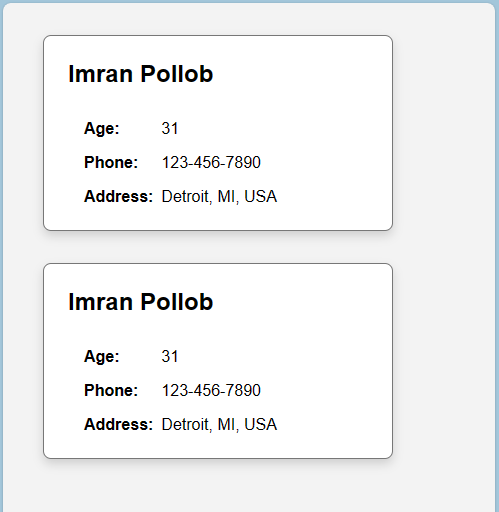
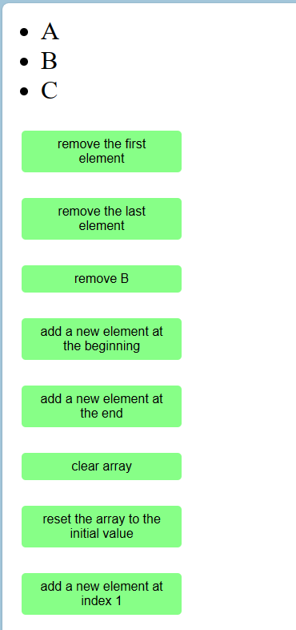
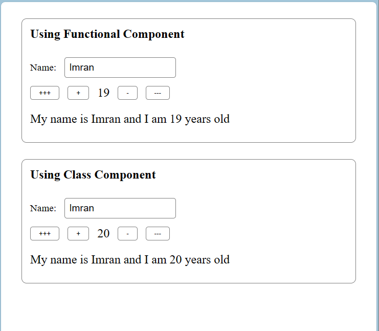
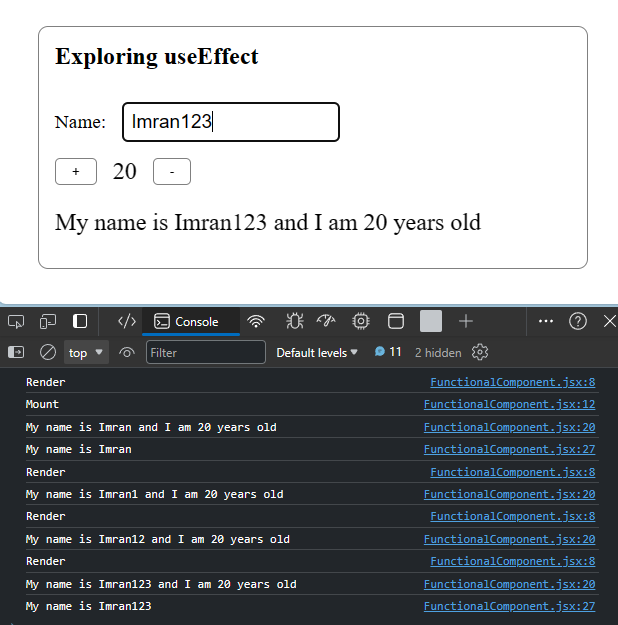
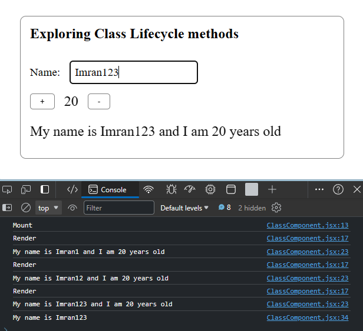

# ReactJS Simplified

Create a vite reactjs application
```
npm create vite@latest 
```

Following these repositories:
1. https://github.com/WebDevSimplified/React-Simplified-Beginner-Projects
2. https://github.com/WebDevSimplified/React-Simplified-Advanced-Projects
3. https://github.com/WebDevSimplified/React-Simplified-Bonus-Project


## 01-user-card

- How to import css and json files
- How to pass data using props
- Functional and class components
- Difference between default and non default export
- css grid layout
- css rem unit (see https://g.co/gemini/share/5e91f05a9254)




## 02-array-component

- how to use useState
- calling useState directly from onClick
- calling useState from a function
- array destructuring
- array filter and slice




## 03-name-counter

- concurrent state change issue
- fix the issue by using function as argument 
- transformation between class and functional component
- this.setState((prevState) => ({ age: prevState.age - 1 }));
- setAge((newAge) => newAge - 1);




## 04-use-effect-exercises

- remove React.StrictMode
- using useEffect
- useEffect dependency array and cleanup
- clearing setInterval, same for event listeners




## 05-lifecycle-method-exercises

- remove React.StrictMode
- using componentDidMount, componentDidUpdate, componentWillUnmount
- difference from useEffect is componentDidUpdate becomes lengthy
- cleanup happends in two places, in componentDidUpdate and componentWillUnmount
- componentDidMount and componentWillUnmount is straight forward

